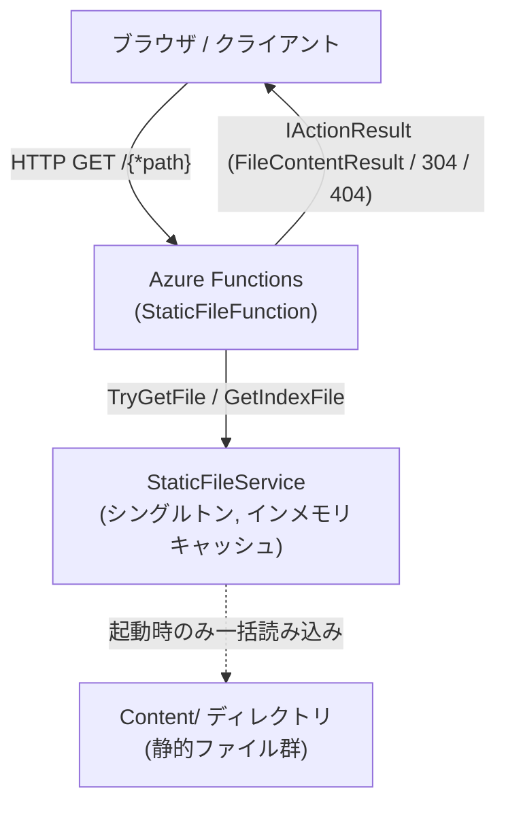
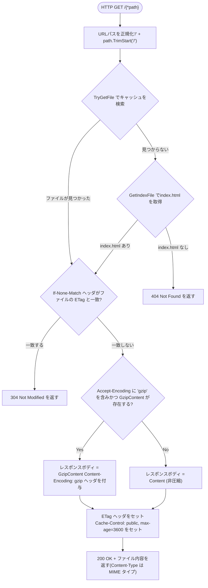

# StaticContentOnAzureFunctions

Azure FunctionsでバンドルされたSPAのフロントエンド静的コンテンツを返すC# プログラムです。

以下のプロンプトで生成

## Azure Functions .Net10 Flex Consumptionsで稼働するContentディレクトリにバンドルされたSPAのフロントエンドの静的ファイルを返すプログラムを作ってください。
- インスタンス起動時にディレクトリ内のファイルをすべてメモリに読み込んで、リクエスト発生時はIOを行わずメモリから返すようにしてください。
- 存在しないパスがリクエストされた場合は404を返すのではなくindex.htmlにリダイレクトしてください。
- ファイルのSHA256からETagを生成してください。
- MIME Typeを拡張子から判定してContent-Typeを設定してください。なお文字コードはすべてUTF-8です。
- レスポンスにはCache-Controlヘッダ で1時間ブラウザ側でキャッシュさせるようにしてください。
- If-None-Matchヘッダを適切に処理してください。
- html、js、css、json、txtはインスタンス起動時にファイルから読み込む際にgzip版も生成して、リクエストのaccept-encodingにgzipがある場合はgzip版を優先して返してください。

---

## 詳細仕様

### 技術スタック

| 項目 | 内容 |
|------|------|
| ランタイム | .NET 10 |
| Azure Functions バージョン | v4 (Isolated Worker モデル) |
| 推奨ホスティングプラン | Azure Functions Flex Consumption |
| HTTP フレームワーク | ASP.NET Core Integration (`ConfigureFunctionsWebApplication`) |

---

### プロジェクト構成

```
StaticContentOnAzureFunctions/
├── StaticContentOnAzureFunctions/        # メインプロジェクト
│   ├── Program.cs                        # エントリポイント・DI設定
│   ├── StaticFileFunction.cs             # Azure Function (HTTPトリガー)
│   ├── StaticFileService.cs              # ファイルキャッシュサービス
│   ├── host.json                         # Azure Functions ホスト設定
│   ├── local.settings.json               # ローカル開発設定
│   └── Content/                          # 配信する静的ファイルを格納するディレクトリ
│       ├── index.html
│       ├── main.js
│       └── styles.css
└── StaticContentOnAzureFunctions.Tests/  # xUnit テストプロジェクト
    └── StaticFileServiceTests.cs
```

---

### アーキテクチャ図



---

### 起動時初期化フロー

```mermaid
flowchart TD
    Start([アプリケーション起動]) --> Register["Program.cs: StaticFileService をシングルトン登録"]
    Register --> Ctor["StaticFileService コンストラクタLoadFiles(contentDirectory) 呼び出し"]
    Ctor --> Exists{Content/ ディレクトリが存在するか?}
    Exists -- No --> EmptyCache["空のキャッシュを返す"]
    Exists -- Yes --> Enumerate["ディレクトリ内の全ファイルを再帰列挙(サブディレクトリ含む)"]
    Enumerate --> ForEach["各ファイルに対してループ処理"]
    ForEach --> ReadBytes["ファイルを byte[] として読み込み"]
    ReadBytes --> CalcETag["SHA-256 ハッシュから ETag を計算(小文字16進数, ダブルクォート付き)"]
    CalcETag --> GetMime["拡張子から MIME タイプを判定"]
    GetMime --> GzipCheck{gzip 対象拡張子か?(.html .js .css .json .txt)}
    GzipCheck -- Yes --> Compress["GZipStream (CompressionLevel.Optimal) でgzip 圧縮バージョンを生成"]
    GzipCheck -- No --> NoGzip["GzipContent = null"]
    Compress --> Store
    NoGzip --> Store["CachedFile を辞書に格納\nキー: /相対パス (大文字小文字区別なし)"]
    Store --> ForEach
    ForEach --> Done([初期化完了以降はメモリからのみ応答])
    EmptyCache --> Done
```

---

### リクエスト処理フロー



---

### クラス詳細

#### `CachedFile` (レコード型)

起動時にメモリに読み込まれたファイルを表すデータクラスです。

| プロパティ | 型 | 説明 |
|---|---|---|
| `Content` | `byte[]` | 元のファイル内容 |
| `GzipContent` | `byte[]?` | gzip 圧縮済みコンテンツ (非対象ファイルは `null`) |
| `ETag` | `string` | `"<SHA-256小文字16進数>"` 形式の ETag 文字列 |
| `ContentType` | `string` | MIME タイプ文字列 |

#### `StaticFileService` (シングルトン)

| メソッド | 説明 |
|---|---|
| `TryGetFile(string path, out CachedFile? file)` | URLパスでキャッシュを検索し、見つかれば `true` とファイルを返す |
| `GetIndexFile()` | `/index.html` のキャッシュエントリを返す。なければ `null` |
| `static ComputeETag(byte[] content)` | コンテンツの SHA-256 ハッシュから ETag 文字列を生成する |
| `static GetContentType(string filePath)` | ファイルパスの拡張子から MIME タイプ文字列を返す |
| `static CompressGzip(byte[] data)` | バイト配列を gzip 圧縮して返す |

**内部キャッシュ**: `Dictionary<string, CachedFile>` (大文字小文字区別なし)  
**キーの形式**: `/` + ファイルの相対パス（パス区切りは `/` に統一）

#### `StaticFileFunction` (Azure Function)

| 項目 | 内容 |
|---|---|
| Function 名 | `StaticFile` |
| トリガー | HTTP トリガー |
| 認証レベル | `Anonymous` (認証不要) |
| 受け付ける HTTP メソッド | `GET` のみ |
| ルート | `{*path}` (ワイルドカード, ルート `/` を含む全パスにマッチ) |

---

### HTTPヘッダ仕様

#### レスポンスヘッダ

| ヘッダ | 値 | 条件 |
|---|---|---|
| `Content-Type` | MIME タイプ (例: `text/html; charset=utf-8`) | 常に付与 |
| `ETag` | `"<SHA-256ハッシュ>"` | 常に付与 |
| `Cache-Control` | `public, max-age=3600` | 200 OK 応答時のみ (304 応答には付与されない) |
| `Content-Encoding` | `gzip` | gzip 圧縮コンテンツを返す場合のみ |

#### リクエストヘッダの処理

| ヘッダ | 処理内容 |
|---|---|
| `If-None-Match` | ファイルの ETag と一致する場合、`304 Not Modified` を返してボディ送信を省略する |
| `Accept-Encoding` | `gzip` を含む場合、gzip 圧縮済みコンテンツを優先して返す |

---

### MIME タイプ対応表

| 拡張子 | Content-Type | gzip 圧縮 |
|---|---|:---:|
| `.html`, `.htm` | `text/html; charset=utf-8` | ✅ |
| `.js`, `.mjs` | `application/javascript; charset=utf-8` | ✅ |
| `.css` | `text/css; charset=utf-8` | ✅ |
| `.json`, `.map` | `application/json; charset=utf-8` | ✅ |
| `.txt` | `text/plain; charset=utf-8` | ✅ |
| `.xml` | `application/xml; charset=utf-8` | ❌ |
| `.svg` | `image/svg+xml; charset=utf-8` | ❌ |
| `.ico` | `image/x-icon` | ❌ |
| `.png` | `image/png` | ❌ |
| `.jpg`, `.jpeg` | `image/jpeg` | ❌ |
| `.gif` | `image/gif` | ❌ |
| `.webp` | `image/webp` | ❌ |
| `.woff` | `font/woff` | ❌ |
| `.woff2` | `font/woff2` | ❌ |
| `.ttf` | `font/ttf` | ❌ |
| `.eot` | `application/vnd.ms-fontobject` | ❌ |
| `.mp4` | `video/mp4` | ❌ |
| `.webm` | `video/webm` | ❌ |
| `.pdf` | `application/pdf` | ❌ |
| (その他) | `application/octet-stream` | ❌ |

> gzip 圧縮はテキスト系のファイルのみに適用されます。画像・動画・フォントなどバイナリ形式のファイルには適用されません。

---

### SPA ルーティングサポート

存在しないパスへのリクエストは `404 Not Found` を返さず、`index.html` の内容を返します。  
これにより、React / Vue / Angular 等のシングルページアプリケーション (SPA) のクライアントサイドルーティングが正しく機能します。

```
GET /some/deep/route  → (キャッシュになければ) → index.html の内容を 200 で返す
```

`index.html` もキャッシュに存在しない場合のみ `404 Not Found` を返します。

---

### ビルドとテスト

```bash
# ビルド
dotnet build StaticContentOnAzureFunctions/StaticContentOnAzureFunctions.csproj

# テスト実行
dotnet test StaticContentOnAzureFunctions.Tests/StaticContentOnAzureFunctions.Tests.csproj
```

テストは xUnit を使用し、以下の項目を検証しています。

- ファイルの検索・取得 (`TryGetFile`, `GetIndexFile`)
- MIME タイプの判定 (`GetContentType`)
- ETag の計算と一貫性 (`ComputeETag`)
- gzip 圧縮の生成と検証 (`CompressGzip`, 対象/非対象拡張子)
- サブディレクトリのファイル読み込み
- `Content/` ディレクトリが存在しない場合の安全な初期化

---

### デプロイ時の注意

- `Content/` ディレクトリ以下のファイルがデプロイパッケージに含まれるよう、ビルド設定で `CopyToOutputDirectory: PreserveNewest` が設定されています。
- `local.settings.json` はローカル開発専用であり、デプロイパッケージには含まれません (`CopyToPublishDirectory: Never`)。
